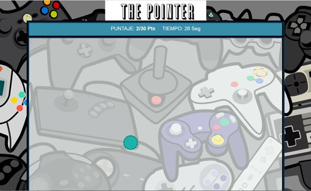

# THE POINTER 
## 1.Descripcion(minijuego)
The pointer es un mini juego hecho con base a  HTML con herramientas como  js y css.

## 2.Caracteristicas
 ### El objetivo es llegar al puntaje establecido en el límite de tiempo que se da.
 
  ### Los pasos que se deben realizar  para jugar son:
*	Hacer click en el círculo turquesa.
*	Cada click cuenta como 1pts y el círculo cambiara de posición.
*	Para ganar llegar  a los 30 pts. antes del tiempo límite. 
*	Para volver a jugar solo completa el juego o hasta que termine el tiempo.
*	También puede reiniciar dando a la tecla f5 o refresh en página.
## 3.Funcion
La función del juego es de herramienta de práctica que ayudara a la mejora de reflejos y sentidos para juegos como shoters, moba  donde el uso eficaz del mouse es clave.

### git hub repositorio: https://github.com/BryanBMQQ/JuegoPointer

### Enlace Web: https://bryanbmqq.github.io/JuegoPointer/
